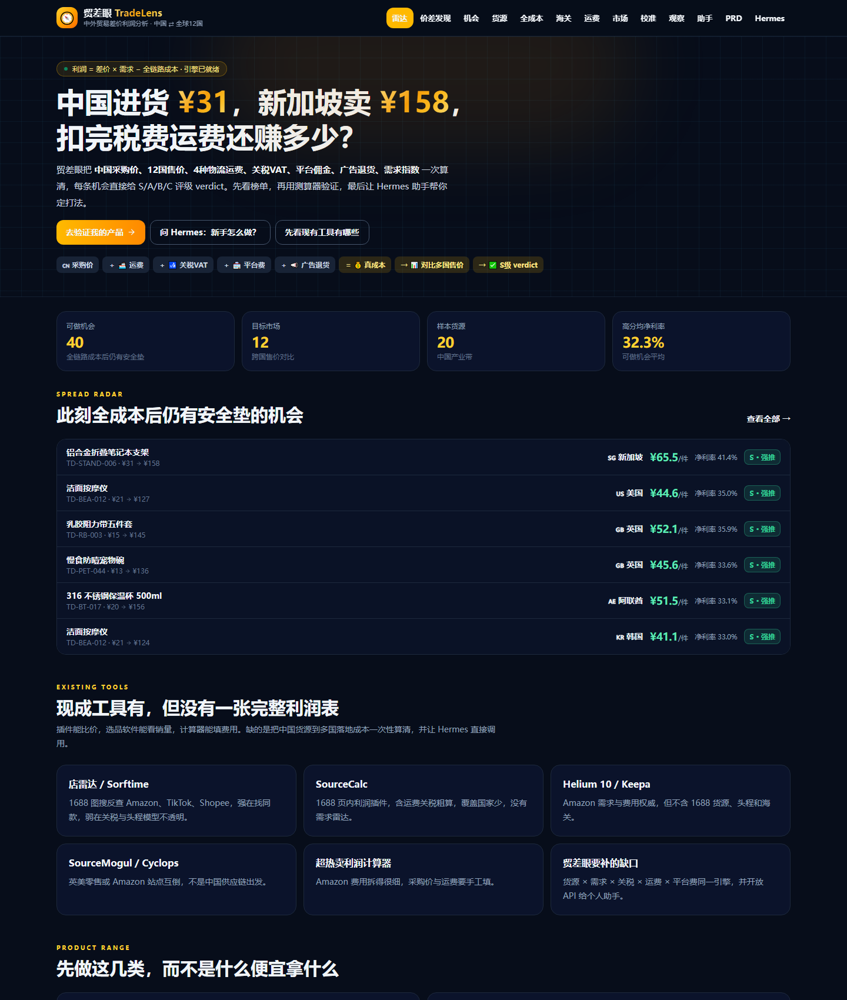
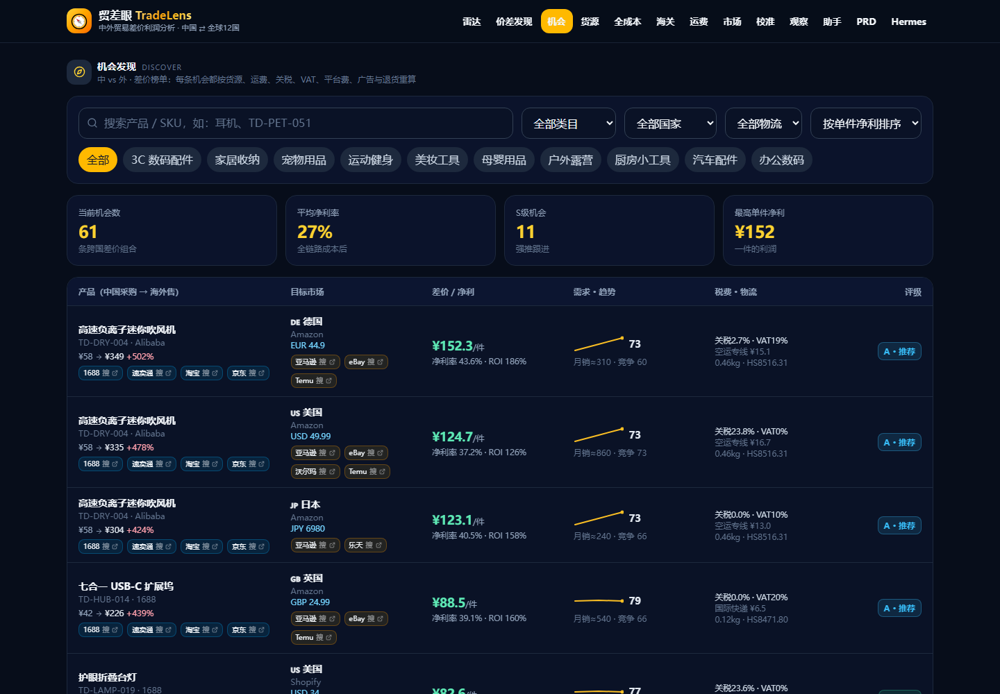
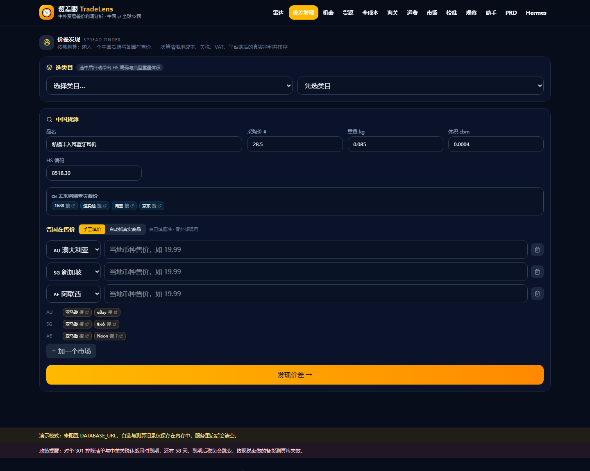

# TradeLens · 贸差眼

把中国货源价、目标国售价、国际运费、海关关税与 VAT、平台佣金、广告与退货摊进同一张利润表。

> 市面上的工具是割裂的：海外选品工具不知道中国采购成本，中国采购平台不知道海外终端动销，
> 关税/运费工具是孤立的单点查询。TradeLens 把这三段接成一条链。



---

## 这个产品要纠正的一个认知

**毛差价不是利润。** 实测同一款蓝牙耳机：

| 市场 | 折人民币 | 毛差价 | **净利** | 净利率 | 关税 | 免税门槛 |
| --- | --- | --- | --- | --- | --- | --- |
| 🇩🇪 德国 | ¥170 | +497% | **¥62.6** | 36.8% | 0% | 免税 <$160 |
| 🇺🇸 美国 | ¥134 | +370% | **¥28.9** | 21.5% | **20%** | **需计税** |

毛差价 370% vs 497% 看着接近，净利差 2.2 倍——差距几乎全部来自美国的 20% 关税
（含 2026-07-24 生效的 Section 301 强迫劳动加征 12.5%）与归零的小额免税门槛。

所以榜单**一律按净利排序，毛差价只作展示**。



## 核心能力

| 能力 | 说明 |
| --- | --- |
| **全成本精算** | 关税以 CIF 为基数、VAT 在关税之上复利叠加、计费重取实重与体积重较大者。纯函数、无 IO、单测锁定 |
| **实盘核验** | Firecrawl 抓各站真实在售价，与模型基准值对比并重算利润。每个数字都能点开看到出处 |
| **同档位过滤** | 搜索结果常混入品牌货。用**保本价**做下界、货源成本倍数做上界，剔除不同档位商品后再取中位数 |
| **合规硬拦截** | 34 个子类目挂了准入红线。母婴类无 CPC/EN71 证书**禁止进入候选池**——不是提示，是禁用按钮 |
| **政策版本化** | 贸易救济措施带生效日期，支持按历史日期回溯计税；已知政策悬崖提前预警 |
| **Hermes 接入** | `GET /api/assistant/tools` 返回工具描述，个人助手可直接调用本站引擎 |



## 快速开始

```bash
npm install
npm run dev          # http://localhost:3000
```

**不需要数据库也能跑。** 未配置 `DATABASE_URL` 时应用以内存演示模式启动：
参考数据（市场 / 商品 / 税则 / 运价 / 平台费率）来自种子常量，自选、测算记录与抓取快照存在进程内存中，重启清空。
页脚会显示演示模式提示，不会让人误以为数据已落库。

### 启用持久化

```bash
docker compose up -d db
cp .env.example .env          # 填入 docker-compose 里的连接串
npm run db:push               # 建表
npm run dev                   # 首次启动自动灌种子
```

`GET /api/health` 会回报当前用的是哪套存储：

```json
{ "ok": true, "store": "postgres", "durable": true }
```

### 可选环境变量

| 变量 | 作用 | 不配的后果 |
| --- | --- | --- |
| `DATABASE_URL` | Postgres 连接串 | 走内存演示模式 |
| `FIRECRAWL_API_KEY` | 抓取配额账户 | 走匿名调用，有限流但可用 |

## 常用命令

| 命令 | 说明 |
| --- | --- |
| `npm run dev` | 开发服务器 |
| `npm run build` | 生产构建（不需要数据库） |
| `npm test` | 单元测试 |
| `npm run verify` | typecheck + lint + test |
| `npm run db:push` | 按 schema 建表（需 `DATABASE_URL`） |

## 架构

```
src/
  app/              Next.js App Router：页面 + API 路由
  components/       UI 组件
  lib/
    profit.ts         全成本精算引擎 + 保本售价逆推（纯函数，无 IO）
    spread.ts         价差发现：按需跨市场测算与排序
    trade-remedies.ts 贸易救济措施（带生效日期，与 HS 税则分开存）
    taxonomy.ts       子类目准入判定与物流约束
    marketplace-urls.ts 各平台真实链接构造
    catalog.ts        目录查询与机会构建
    assistant.ts      Hermes 助手意图识别；assistant-live.ts 实盘核验
  server/
    http.ts         API 边界：Zod 入参校验 + 错误归一化
    providers/      外部数据源
      ecb.ts          欧央行官方汇率
      usitc.ts        美国 HTS 税则（仅 MFN 基础税率）
      firecrawl.ts    抓取与结构化抽取 + 校验闸门
      amazon-search.ts 搜索页解析、价格分布、同档位过滤
    store/          数据访问层
      types.ts        TradeStore 接口
      postgres.ts     Postgres 实现（含幂等灌种子）
      memory.ts       内存实现（演示模式）
      seed-catalog.ts 种子数据 → 行数据的唯一转换入口
  db/               Drizzle schema 与惰性连接
```

**分层原则**：业务代码只依赖 `TradeStore` 接口，不直接 import drizzle。
两套实现产生的主键完全一致（在 `seed-catalog.ts` 里确定性分配），
所以 `/products/42` 在演示模式和持久化模式下指向同一个商品。

## 计算口径

精算引擎刻意对齐真实报关口径，这几处是 Excel 手算最常出错的地方：

- **关税以 CIF 为基数**（货值 + 运费 + 保费），不是货值。
- **VAT 计税基 = CIF + 关税**，是复利叠加，不是只对 CIF 征。
- **关税三层叠加**：MFN 基础税率 + HS 对应的 301 清单税率 + 按原产地生效的贸易救济措施。
  加征部分与 HS 税则分开存——官方税则接口查不到它们，混在一起会在刷新税则时被洗掉。
- **计费重取实重与体积重的较大者**（1 CBM = 167kg）；海运则按 CBM 计费，不折体积重。
- **最低收费按订单件数摊薄**后再与按重量计算的运费取大。
- VAT 可抵扣时不计入到岸成本，但仍会报出税额。
- **保本售价** = 固定成本 / (1 − 比例费率和)；费率和 ≥ 1 时返回 `Infinity` 而非一个看似可行的数字。

以上口径均有单元测试锁定，见 `src/lib/profit.test.ts`。

## 数据来源与可信度

不同数据的可信度差别很大，UI 上逐项标注，**不把基准值和实测值混在一起展示**：

| 数据 | 来源 | 状态 |
| --- | --- | --- |
| 汇率 | 欧央行每日参考汇率 | ✅ 实时（报关计价应用官方汇率，非商业行情） |
| 美国 MFN 税率 | USITC HTS | ✅ 官方（仅基础税率，301/232 属 Chapter 99，另行维护） |
| 贸易救济加征 | 人工维护，带生效日期与法律依据 | ⚠️ 需跟进政策 |
| 海外在售价 | Firecrawl 抓取，6 小时快照缓存 | ✅ 按需实时 |
| 运价 / 平台费率 | 模型基准值 | ⚠️ 待接入 |
| 英国 / 欧盟税则 | HMRC 需 OAuth 凭据；TARIC 无公开 REST API | ❌ 未接入 |

> **⚠️ 基准售价系统性偏高。** 多轮实测显示种子里的海外售价比真实在售价高 **27%~55%**，
> 部分机会按实测价重算后从「可做」变成「薄利」甚至亏损。
> 打开 `/calibration` 可逐条核验；下单前请以实测价与真实商品链接为准。

## 对外接口

`GET /api/assistant/tools` 返回工具描述，供 Hermes 等个人助手接入。

| 接口 | 用途 |
| --- | --- |
| `GET /api/opportunities` | 差价机会榜单 |
| `POST /api/calculator` | 全成本利润测算 |
| `POST /api/discover` | 按需价差发现（手工填价或自动抓真实商品） |
| `GET /api/live-price` | 拉取某市场真实在售价与商品链接 |
| `GET /api/calibrate` | 用实测价校准基准值 |
| `GET /api/taxonomy` | 类目树、子类目准入判定与关键词检索 |
| `GET /api/customs` `/api/shipping` `/api/markets` `/api/products` | 参考数据 |

## 数据免责

关税与 de minimis 政策变动频繁（下一个悬崖：**2026-11-10** 对华 301 排除清单与中美关税休战同时到期），
运价与平台费率仍为模型基准值。实操前请复核报关行与承运商报价及目的国认证要求。

HS 编码给到 6 位且标记为未校验——供应商提供的编码常常是为了最大化其自身出口退税，
与目的国海关认定未必一致，8~10 位叶子须按目的国现场解析。
